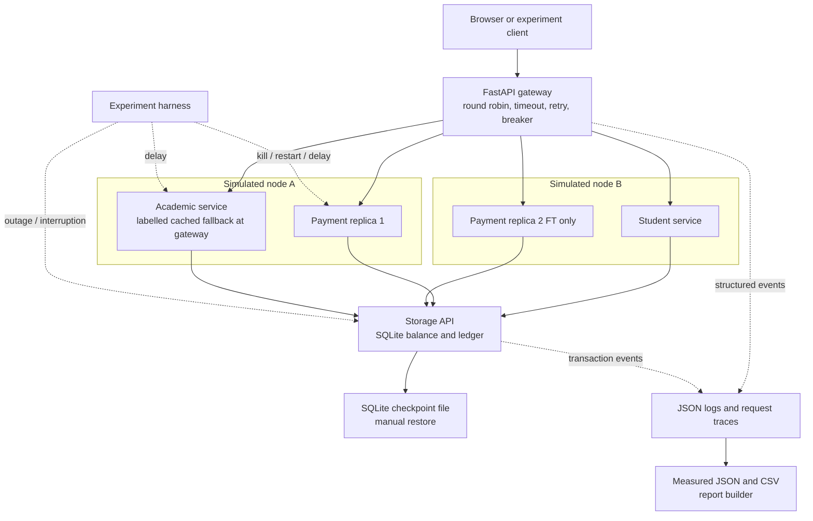

# Architecture

All nodes are local processes in the measured deployment. Node A loss means terminating **payment1 and academic together**. Node B is a logical grouping, not another physical machine. Docker Compose can run the same topology, but a single Docker host still has the same host-level failure domain.

The gateway is intentionally custom and small, so the retry/failover/breaker implementation is visible in `app/resilience.py`. It makes at most three attempts, selects a different replica after a failed attempt, and rejects open circuits. A HALF_OPEN circuit admits one trial request. Health endpoints report process liveness; they do not prove database readiness. The status screen also shows breaker state.

Only the storage process opens SQLite. Payment replicas share the same idempotency-key constraint and atomic transaction boundary. This prevents two replicas from independently accepting the same payment. Currency is stored as integer tiyn, and balance cannot become negative through an accepted payment.

Baseline and FT share code and validation to keep the comparison understandable. Baseline has one payment replica, no gateway recovery policy and no payment-key protection. It deliberately commits the balance before the ledger. FT wraps both changes in one transaction with a savepoint. A timeout after commit is handled by returning the existing payment on a retry with the same key and payload. A conflicting payload returns HTTP 409.

Two independent forms of infrastructure protection are demonstrated: redundant payment processes with routing/failover, and a storage backup checkpoint with restoration. Load balancing is also an explicit infrastructure mechanism. The backup is on the same local disk; it demonstrates logical recovery, not protection against disk or host loss. Restoring a checkpoint discards later writes, including their idempotency history, so real systems require reconciliation and separate backup storage.

Single points of failure remain: gateway, SQLite owner, student service, academic service, operating system and disk. Failure of academic records is contained by a labelled degraded transcript response. Failure of the shared database stops business operations safely. No payment success is fabricated by a fallback.
